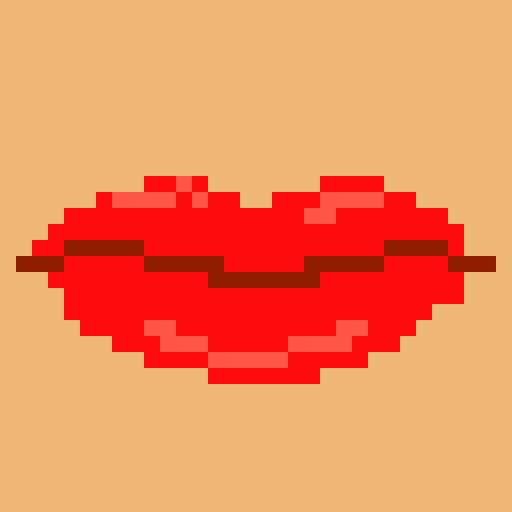

<!DOCTYPE html>
<html>
<head>
  <link rel="stylesheet" href="main.css">
  <link href="https://fonts.googleapis.com/css?family=VT323&display=swap" rel="stylesheet">
</head>
<body>

<!--   

  <map name="mouthmap">
    <area shape="rect" coords="296,254,241,206" href="2uvula.html">
  </map> -->

  

<map name="mouthmap">
    <area shape="rect" href="2uvula.html" coords="357,332,182,205">
</map>

  
Ready to be swallowed? Hop inside!

</body>
</html>